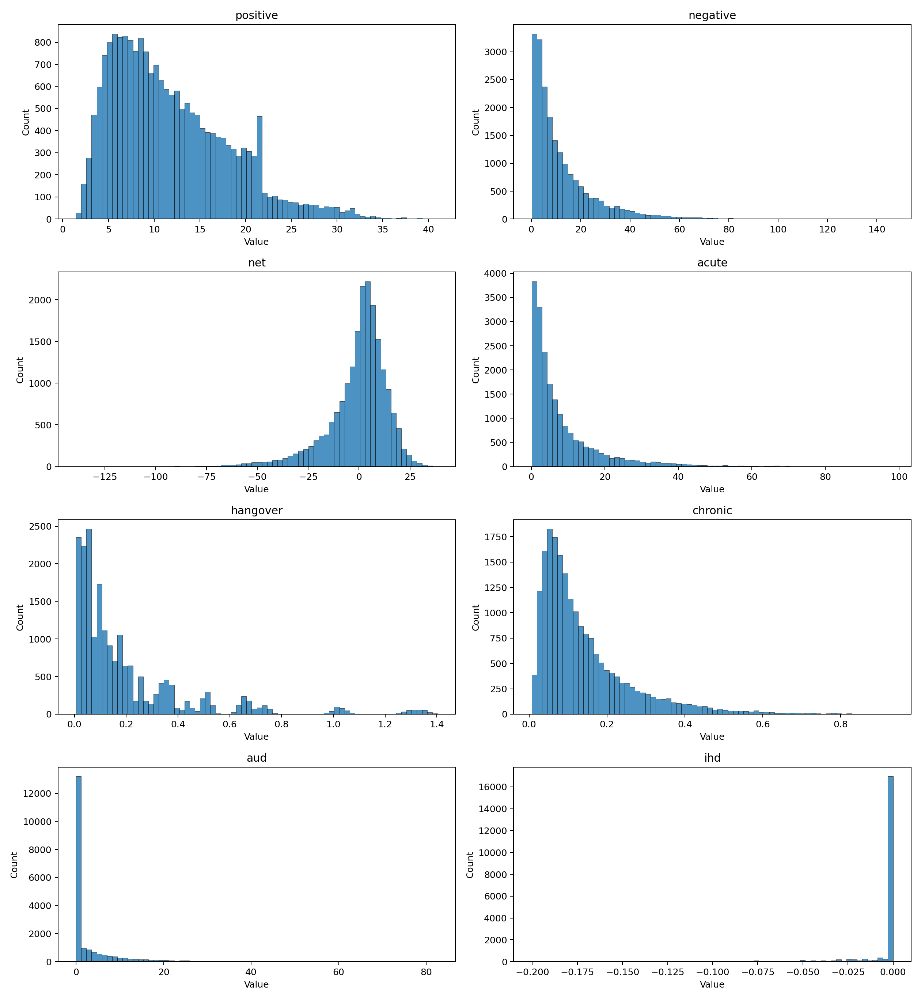

# Final Report (First Draft)

## 1) Purpose and framing

This draft summarizes the current state of the alcohol utility model as implemented in `sim.cpp` and exercised by `run_report_sequence.sh`, using the generated outputs in `out/`.

The model evaluates **lifetime discounted utilons** under alcohol exposure, where:

- Positive utilons come from short-run wellbeing gains (enjoyment, relaxation, social, mood channels).
- Negative utilons come from acute harms, hangover burden, chronic health proxies, and AUD burden.
- Net utilons are computed as: **positive - negative**.

The conceptual framing and units are aligned with the two design docs:

- `positive.md`: utilon as a WELLBY-like LS-point-year; positive channels and conversion logic.
- `negative.md`: negative utilon channels, event/chronic decomposition, and DALY/QALY-to-WELLBY bridge.

---

## 2) What the simulator does

At a high level, each run samples uncertain person-level and harm parameters, simulates exposure over a 60-year horizon, applies continuous discounting, and returns lifetime totals.

### 2.1 Exposure generation

Daily drinks are generated from a mean `drinks_per_day` under one of three day-count models:

- `constant`
- `two_point`
- `poisson` (default)

All are capped at `max_drinks_cap`.

### 2.2 Positive module

For each sampled person, daily positive uplift is modeled as a saturating function of drinks with weighted subcomponents:

- enjoyment
- relaxation
- social term (when social day)
- mood

The uplift is scaled and capped by a person-specific `max_daily_ls_uplift`.

### 2.3 Negative module

Negative utility is additive across channels:

1. **Acute events**: traffic injury, non-traffic injury, violence, poisoning.
2. **Hangover**: binge-triggered probability and duration.
3. **Chronic proxies**: cancer, cirrhosis, AF via exposure-dependent risk transforms.
4. **AUD**: Markov-like state process (never AUD -> active -> remission/relapse) with disability and depression add-on.

An IHD term is calculated separately and printed but not netted by default in the reported `negative` total.

### 2.4 Two simulation modes

- `expected` mode: hybrid approach that analytically uses PMFs for expected components plus sampled annual exposure dynamics.
- `daily` mode: explicit day-by-day event simulation for the full horizon.

### 2.5 Uncertainty treatment

Uncertainty is propagated by Monte Carlo draws over discrete parameter menus (choice lists). These lists can be inspected with `--list-choice-params` and overridden from CLI.

---

## 3) How the provided outputs were produced

`run_report_sequence.sh` runs:

1. build + help + parameter menu dump
2. baseline (20k runs, expected mode, 1.5 drinks/day) + histogram
3. intake sweep (0 to 6 drinks/day, 0.25 step)
4. sensitivity batches (discount/QALY map; causality; acute risk; chronic+IHD)
5. scenarios:
   - never drink and drive
   - no binge episodes
   - abstinence
6. seed robustness (301-305)
7. daily-mode sanity run (3k runs)

---

## 4) Core results

## 4.1 Baseline (expected mode, 1.5 drinks/day)

From `out/baseline.txt`:

- Positive mean: **11.7846**
- Negative mean: **19.5476**
- Net mean: **-7.7630**
- Net median (p50): **-1.4088**

Negative mean decomposition:

- Acute: **15.7273**
- Hangover: **0.1987**
- Chronic proxies: **0.1407**
- AUD: **3.4809**

Interpretation: in this baseline parameterization, acute harms dominate negative utilons, with AUD as the second-largest component.

## 4.2 Intake sweep

From `out/sweep_drinks_per_day.txt`, median net utilons become more negative as drinks/day rises. The best median outcome in the tested range is:

- **0.00 drinks/day -> median net 0.0000**

At selected exposures:

- 1.50 drinks/day -> median net -1.6946
- 3.00 drinks/day -> median net -9.4846
- 6.00 drinks/day -> median net -40.9149

## 4.3 Scenarios (decision-oriented)

Compared with baseline net mean (-7.7630):

- **Never drink and drive** (`scenario_never_drink_drive`): net mean **-0.5475**
  - large improvement, mostly via reduced traffic-related acute burden.

- **No binge episodes** (`scenario_no_binge`): net mean **-5.4658**
  - improvement vs baseline, with hangover dropping to 0 and AUD burden reduced.

- **Abstinence** (`scenario_abstinence`, 0 drinks/day): net mean **-1.3325**
  - positive utilons go to 0; remaining negatives are mostly AUD legacy burden in current model structure.

## 4.4 Sensitivity batches

All four sensitivity batches still show negative net means around baseline magnitude:

- discount/QALY mapping: net mean **-8.1267**
- causality weights: net mean **-7.8596**
- acute-risk menus: net mean **-7.8746**
- chronic/IHD menus: net mean **-7.6511**

This indicates directional robustness for the sign of baseline net utilons under tested parameter menu variants.

## 4.5 Seed and mode checks

- Seed robustness (`301-305`) keeps net means in a tight range (about **-7.69 to -7.99**).
- Daily mode (`baseline_daily_mode`) gives net mean **-7.9463**, broadly consistent with expected mode baseline.

---

## 5) Visuals

### Baseline distribution (net utilons)

### Scenario: never drink and drive (net utilons)

---

## 6) Reading this model correctly (important caveats)

1. **This is an uncertainty-propagating scenario model, not a causal estimate from one identified dataset.**
2. **Results are sensitive to parameter menus and structural assumptions** (especially acute event rates, AUD dynamics, and conversion factors).
3. **IHD is treated separately** and not automatically netted into the main negative total.
4. **Positive effects are short-run and saturating**, while some negative channels accumulate over long horizons.
5. The current outputs are best interpreted as a **first integrated balance-sheet draft**, useful for comparing assumptions and interventions.

---

## 7) Suggested next steps for the final report

1. Add a compact appendix table listing all CLI parameter menus used in each run block.
2. Add one standardized “attribution policy” section clarifying what is ethanol-attributable vs context-attributable.
3. Add calibration checks against external incidence anchors for acute injuries and AUD prevalence trajectories.
4. Add a dedicated section on why abstinence still has residual negative utility in the current formulation (AUD process assumptions).
5. Add uncertainty presentation beyond means (e.g., probability net > 0, and interval summaries across scenario families).

---

## 8) Reproducibility note

Primary script and source files:

- Model code: `sim.cpp`
- Runbook: `run_report_sequence.sh`
- Positive design reference: `positive.md`
- Negative design reference: `negative.md`
- Outputs: `out/*.txt`, `out/*.csv`, `out/*.png`

This document is intended as a **first draft** suitable for iteration into a polished final report.
