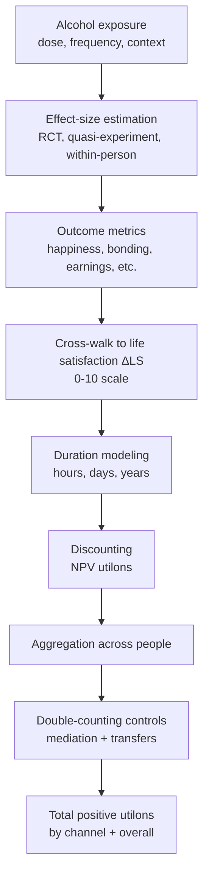
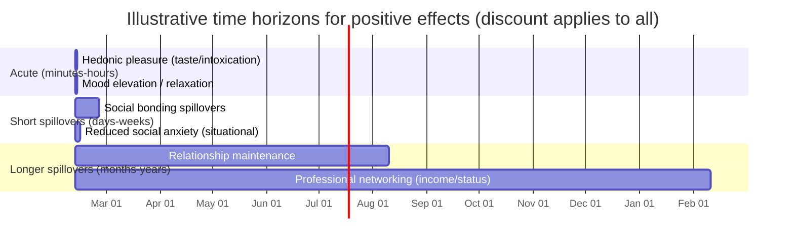

# A Reproducible Utilon Framework for Quantifying the Positive Effects of Alcohol Consumption

## Executive summary

This report specifies a rigorous, reproducible method to quantify the *positive* effects of alcohol consumption in a single welfare unit (“utilon”) that can later be compared against negative utilons. The core design choice is to define one utilon as a **wellbeing-adjusted life-year**: a **one-point change on a 0–10 life satisfaction scale sustained for one person for one year** (or any equivalent fraction). This matches the WELLBY concept used in contemporary wellbeing cost-effectiveness analysis and is directly compatible with population aggregation and time discounting. citeturn0search8turn0search0turn0search1

The framework is **evidence-anchored** rather than preference- or “consumer surplus”-anchored. You convert empirical findings (e.g., momentary happiness while drinking; experimentally measured social bonding; wage differences correlated with social drinking) into utilons by mapping them to **life satisfaction points over person-time**, applying explicit **time horizons**, **discounting**, and **de-duplication rules**.

A key methodological safeguard is **attribution control**: many “benefits of drinking” are really benefits of *social context* (friends, rituals, third places) rather than ethanol pharmacology. Randomized alcohol-administration studies with **alcohol vs placebo vs control** arms allow a decomposable attribution: (i) *context effect* (being in a social drinking situation), (ii) *expectancy effect* (believing you drank), and (iii) *pharmacological ethanol effect* (ethanol beyond expectancy). citeturn7view0turn16search22

Worked examples show how to convert published effect sizes into utilons. One example uses a large smartphone-based dataset finding people are **happier at the moment of drinking** (+3.88 points on a 0–100 happiness scale); another uses a large alcohol-administration group experiment reporting **higher self-reported bonding** (PGRS difference 0.48 on a 1–9 scale). citeturn3search3turn7view0

Assumptions not stated in the prompt (made explicit here):
- **Population**: general adult population (18+), unless an effect is intrinsically subgroup-specific (e.g., social anxiety clinical sample). citeturn0search1turn18search8  
- **Alcohol types**: all alcoholic beverages, standardized by grams of ethanol; U.S. “standard drink” ≈ 14 g ethanol is used only as a convenience unit. citeturn17search0turn17search6  
- **Consumption patterns**: single-occasion and habitual use; benefits modeled via dose–response and frequency distributions. citeturn17search4turn18search6  
- **Geography**: method is general; examples cite UK- and US-based datasets typical in the literature. citeturn3search3turn6view1turn18search6  

## Definitions and scope

### What a utilon measures

**Utilon (U)** is defined as an *incremental wellbeing unit* equal to:

> **1 utilon = 1.0 point of life satisfaction (0–10 scale) sustained for 1 person for 1 year.**

This is operationally identical to a WELLBY as defined in the wellbeing-policy literature: one point on a 0–10 life satisfaction scale for one individual for one year. citeturn0search8turn0search0turn0search4

The recommended life satisfaction instrument is the widely used question:

> “Overall, how satisfied are you with your life nowadays?” on a 0–10 scale.

This exact wording and scaling is used by the UK Office for National Statistics (ONS) personal wellbeing measures, and is designed for population measurement. citeturn0search1turn0search5

### Units and sub-units

Because many alcohol-related positive effects are acute, it is convenient to use fractional utilons:

- **utilon-year**: 1.0 LS-point × 1 person × 1 year  
- **utilon-day**: (1/365) utilon-year  
- **utilon-hour**: (1/8760) utilon-year

These are not new units—just rescalings for convenience.

### Population scope and accounting boundary

Default boundary for positive utilons:
- Count **all adult individuals affected**: drinker, peers, household, coworkers, community members, and (optionally) broader society when effects are plausibly external (e.g., “third place” community cohesion). citeturn0search8turn6view1
- Use a **democratic/social welfare sum**: utilons add across persons, with distributional analyses handled separately (unless you explicitly apply equity weights). This matches how WELLBY aggregation is framed in wellbeing policy analysis. citeturn4search1turn0search16

### Alcohol exposure definition

For reproducibility across jurisdictions, parameterize exposure in **grams of ethanol**. A “standard drink” varies internationally (often ~8–23.5 g), so grams are the stable unit. citeturn17search6  
For U.S.-based examples, 1 standard drink ≈ 14 g ethanol per entity["organization","National Institute on Alcohol Abuse and Alcoholism","nih institute, us"] and entity["organization","Centers for Disease Control and Prevention","us public health agency"]. citeturn17search0turn17search1

### Time discounting

Let ΔLS\_{i,t} be the incremental life satisfaction (0–10) for person *i* in year *t* attributable to alcohol (relative to a specified counterfactual). Then discounted utilons over horizon T are:

**Discrete discounting (annual):**  
U = Σ\_{t=0}^{T} [ (Σ\_i ΔLS\_{i,t}) × Δt ] / (1 + r)^t, where Δt is years represented by the time step.

**Continuous discounting:**  
U = ∫\_{0}^{T} (Σ\_i ΔLS\_i(t)) · e^{−rt} dt.

Recommended *default* discount rates (run sensitivity on all):
- **3%/year** (common reference case in U.S. cost-effectiveness guidance). citeturn0search2turn0search6  
- **3.5%/year** (reference case in entity["organization","National Institute for Health and Care Excellence","uk hta agency"] guidance). citeturn0search3turn0search7  
- Sensitivity: 0%, 1.5%, 5% (common alternates in HTA practice). citeturn0search3turn0search7  

### Counterfactual definition

To avoid overstating positives, specify **two counterfactuals** and report both:

1. **Ethanol-attributable counterfactual (preferred for causal attribution):**  
   Same situation (time, place, companions) but alcohol replaced by a non-alcoholic substitute (or placebo), preserving social context. Randomized alcohol/placebo/control experiments directly support this framing. citeturn7view0turn16search22  

2. **Occasion-attributable counterfactual (captures “alcohol enables the occasion”):**  
   Drinking occasion does not occur; time reallocates to typical alternative leisure. This is harder and requires time-use substitution modeling (and can plausibly be larger than ethanol-attributable effects).

Both are defensible, but they answer different questions. For later “positive vs negative utilons,” the ethanol-attributable counterfactual is usually the cleanest for causal comparisons.

## Taxonomy of positive effects and where they sit in the causal chain

The taxonomy below is designed to (a) cover the positive effects you listed, (b) distinguish *final outcomes* (wellbeing) from *intermediate mechanisms* (smiling, speech, network size), and (c) flag where double counting is likely.

| Effect category | Typical mechanism (intermediate) | Primary welfare endpoint to monetize in utilons | Typical time horizon | Double-counting risk |
|---|---|---|---|---|
| Hedonic pleasure (“I enjoy the taste/feeling”) | momentary positive affect, sensory pleasure, stimulation/sedation balance | momentary happiness → mapped to ΔLS over short durations | minutes–hours | medium (overlaps with mood elevation) |
| Short-term mood elevation | positive affect; relaxation; “time out” | momentary/day happiness → ΔLS | hours–1 day | high (overlaps with pleasure + social effects) |
| Social bonding and affiliation | bonding scales; coordinated smiling/speech; perceived group reinforcement | ΔLS via social connectedness pathways or direct wellbeing measures | hours–weeks | high (mediates many downstream benefits) |
| Increased sociability / reduced inhibition | more speech, approach behavior, reduced self-consciousness | ΔLS via improved social interaction quality | hours | high |
| Reduced social anxiety (perceived or expectancy-based) | lower anticipatory anxiety; placebo/expectancy effects | ΔLS via reduced anxiety burden | hours–days | medium (overlaps with sociability) |
| Business/professional benefits | social capital, networking, bargaining outcomes | ΔLS through income/status changes | months–years | medium (risk of transfer/double count) |
| Cultural/ritual benefits | identity, belonging, coordinated rituals | ΔLS via meaning/connectedness | days–years | medium |
| Health benefits (if any) | possible cardiometabolic biomarkers in some observational work | QALYs → mapped to LS or utilons directly | years | medium (but net health is disputed) |
| Economic activity (jobs, taxes, GDP) | employment/income flows; public finance | ΔLS via income/public spending effects | years | very high (often pure redistribution) |

Evidence notes that are relevant when deciding what to include as “positive effects”:
- Large within-person/EMA bodies indicate alcohol use is associated with drinking on **days of higher positive affect**, while day-level negative affect is not a consistent driver in those data. citeturn16search0  
- “Health benefit” claims for moderate drinking are heavily contested: even where observational studies show a J-shaped association for ischemic heart disease, Mendelian randomization evidence often conflicts, and major public health statements emphasize risks (including cancer) from low levels. citeturn2search1turn2search4turn2search10  

## Metrics and recommended data sources for effect sizes

This section focuses on **measurable metrics** and **high-quality data sources** suitable for reproducible estimation.

### Core wellbeing measurement datasets (for direct utilon estimation or cross-walks)

1. **Repeated wellbeing + alcohol measures** (ideal): panel or EMA datasets measuring both alcohol exposure and wellbeing repeatedly, enabling within-person estimation (reducing confounding by stable individual traits). A canonical example is the smartphone-based study contrasting momentary happiness when drinking vs not. citeturn3search3  
2. **Large population surveys with alcohol modules** (good for dose distributions and subgroup modeling):  
   - entity["organization","Substance Abuse and Mental Health Services Administration","us health agency"]’s NSDUH provides national prevalence and patterns of alcohol use (and other substances) for the U.S. population. citeturn18search5turn18search25  
   - entity["organization","Centers for Disease Control and Prevention","us public health agency"] BRFSS collects state-level risk behaviors and has alcohol-related modules and documentation, useful for prevalence and correlates. citeturn18search6turn18search2  
   - entity["organization","National Institute on Alcohol Abuse and Alcoholism","nih institute, us"] provides controlled access to NESARC/NESARC-III—rich diagnostic and disability content for alcohol use disorders and related outcomes. citeturn18search0turn18search8  
   - entity["organization","Understanding Society","uk longitudinal survey"] documents alcohol consumption questions (including AUDIT-C style items) that support longitudinal modeling in UK data. citeturn18search3turn18search7  

### Effect-specific metrics and primary-study anchors

#### Hedonic pleasure and short-term mood elevation

**Measurable metrics**
- Momentary happiness (0–10 or 0–100), positive affect scales (e.g., PANAS), self-reported “liking” or pleasure.
- Laboratory alcohol challenge measures of stimulation/sedation (e.g., biphasic effects), facial-expression indicators of positive emotion.

**Primary/peer-reviewed anchors**
- Smartphone-based within-person analysis: “happier at the moment of drinking” (+3.88 on 0–100 happiness at the moment of drinking). citeturn3search3  
- Evidence base for alcohol–emotion measurement divergence and facial-expression changes under alcohol intoxication in social administration paradigms (useful as intermediate metrics when direct happiness is unavailable). citeturn16search3turn1search19  

#### Social bonding, sociability, and group-affiliation effects

**Measurable metrics**
- Bonding scales (e.g., Perceived Group Reinforcement Scale, PGRS).
- Behavioral coordination (e.g., triadic Duchenne smiles, sequential speech).
- Social network size and trust (survey-based).

**Primary/peer-reviewed anchors**
- Large alcohol-administration group-formation experiment (N=720), reporting higher self-reported bonding under alcohol vs placebo: PGRS mean 7.22 vs 6.74 (1–9 scale). citeturn7view0turn1search1  
- Observational + survey synthesis linking social drinking venues (“locals”) with wellbeing and social engagement measures (uses ONS wellbeing question wording in a national poll). citeturn6view1turn9view2  

#### Reduced social anxiety and stress relief

**Measurable metrics**
- Self-rated anxiety before/after social stressor; physiological measures (heart rate, cortisol).
- Expectancy-driven “confidence” effects (placebo alcohol belief).

**Primary/peer-reviewed anchors**
- Clinical trial in social phobia: no direct anxiety reduction from alcohol vs placebo, but belief of receiving alcohol was related to lower subjective anxiety/negative cognitions—critical for separating expectancy vs pharmacology. citeturn16search2turn16search6  
- Controlled laboratory stress + alcohol infusion study: alcohol can dampen cortisol response if administered immediately after stress, highlighting a measurable stress-physiology pathway (though subjective effects can be mixed). citeturn16search1turn6view2  

#### Business/professional benefits and bargaining outcomes

**Measurable metrics**
- Earnings, wages, promotions, job mobility.
- Negotiation outcomes (payoffs, agreement efficiency), collaboration likelihood in controlled experiments.
- Social capital/network measures as mediators.

**Primary/peer-reviewed anchors**
- Classic labor economics findings of an inverse-U relationship between drinking levels and wages in worksite-based data (illustrative, not necessarily causal under modern standards). citeturn5search0  
- “Drinking premium” hypothesis and social-capital-mediated earnings association using survey data (again, treat as association unless identified causally). citeturn5search4turn5search29  
- Experimental economics suggests alcohol can alter strategic interaction; findings vary by setting, and some negotiation experiments report worse integrative outcomes under alcohol (useful for sensitivity bounds because “business benefits” are not monotone). citeturn15search5turn5search1  

#### Cultural and ritual benefits

**Measurable metrics**
- Participation frequency in alcohol-embedded rituals; self-reported meaning/identity; perceived social cohesion; satisfaction with community life.
- Anthropological documentation of alcohol’s symbolic and utilitarian social functions.

**Primary/peer-reviewed anchors**
- Review of sociocultural themes: alcohol can have utilitarian (bonding, easing interaction) and symbolic meanings (religious rituals, identity). citeturn5search10  

#### Health benefits (if any)

Because this report focuses on positives, the relevant point is **how to treat “health benefit” claims methodologically**:

- Major public health statements emphasize **no safe threshold** for carcinogenic effects at low levels. citeturn2search1turn2search0  
- All-cause mortality meta-analysis controlling for abstainer and former-drinker bias finds **no significant protective association** for low-volume drinking vs lifetime nondrinkers after adjustment. citeturn19search2  
- For ischemic heart disease specifically, observational studies and Mendelian randomization yield **conflicting findings**; treat any “benefit” as high-uncertainty and do not net it out from cancer risk unless you are explicitly computing net health utilons later. citeturn2search10  

## Converting empirical effects into utilons

This is the reproducible “conversion layer.” The unifying strategy is:

1. **Estimate an effect size** of alcohol on a measurable outcome (preferably causal; otherwise label as associational).  
2. **Map that outcome change into ΔLS** (0–10 life satisfaction points).  
3. **Integrate over time** to get person-time LS-point-years.  
4. **Apply discounting** and **aggregate** with double-counting controls.

### General utilon formula

For an effect channel *k*, with an estimated incremental life satisfaction change ΔLS\_k lasting for duration D\_k (in years) affecting N people:

U\_k = N × ΔLS\_k × D\_k × AttributionWeight\_k × DiscountFactor

Where:
- D\_k converts hours/days to years (e.g., 2 hours ≈ 2/8760 years).
- AttributionWeight\_k ∈ [0,1] is explicit and depends on whether you are estimating ethanol-attributable vs occasion-attributable benefits.
- DiscountFactor is (1+r)^{−t̄} using a representative timing t̄ for the effect (or integrate continuously if long-lived).

### Mapping rules by measurement type

#### Direct life satisfaction on the 0–10 scale (best case)

If a study reports an average life satisfaction difference ΔLS directly on the 0–10 scale (e.g., ONS-style), and you can specify duration D, then utilons follow immediately.

**Normalization:** none needed beyond ensuring the same 0–10 metric. The ONS 0–10 wording is a preferred anchor. citeturn0search1  

#### Happiness/affect measured on 0–100 or other scales

If a study reports ΔH on a 0–100 momentary happiness scale, first convert to a 0–10 “happiness points” scale:

ΔH\_{0–10} = ΔH\_{0–100} / 10.

Then you need a **cross-walk** from momentary happiness to life satisfaction:
- Preferred: estimate β\_{LS←H} in a dataset measuring both (panel or EMA with periodic life satisfaction), using within-person fixed effects.
- Minimal reproducible fallback: treat ΔH\_{0–10} as a proxy for ΔLS over very short durations, and report a sensitivity range for β\_{LS←H} (e.g., 0.5, 1.0, 1.5). This is explicitly an assumption and should be sensitivity-tested.

The reason this is needed: alcohol’s effects are often largest “in the moment” and do not necessarily translate 1:1 into evaluative life satisfaction over longer periods, as shown by work finding strong momentary associations but weak long-run life satisfaction changes. citeturn3search3  

#### Intermediate psychosocial outcomes (bonding, anxiety, trust)

For constructs like bonding or anxiety, use one of two reproducible mappings:

**Approach A (preferred): “Cross-walk regression”**  
Estimate ΔLS as:
ΔLS = β × ΔX  
where X is the scale of interest (e.g., bonding score, anxiety rating). β is estimated from a dataset containing both LS and X.

**Approach B: “Outcome valuation via equivalent income”**  
Convert ΔX into an income-equivalent change, then into LS using a causal income→LS estimate (below). This is common in wellbeing valuation frameworks, but requires more assumptions.

#### Monetary outcomes (income, wages, profits, tax revenue)

If an effect produces incremental annual income ΔY (or percent change), convert to ΔLS using an empirically justified coefficient on log income.

A wellbeing-policy literature approach uses:
ΔLS ≈ β\_{lnY} × ln( Y\_1 / Y\_0 )

A recent WELLBY exposition notes using a coefficient β\_{lnY} ≈ 0.4 derived from causal lottery-income designs. citeturn4search1turn4search0

This approach is useful for professional/business benefits (earnings) and some “economic activity” claims. However, for *economic activity,* you must distinguish **net new income** from **redistribution** and **substitution**; see aggregation rules below.

### Attribution decomposition (context vs expectancy vs pharmacology)

To rigorously state “positive effects of alcohol consumption,” separate what is caused by ethanol from what is caused by context and beliefs.

If you have a three-arm design:
- Control: non-alcoholic, no expectation of alcohol
- Placebo: non-alcoholic, expectation of alcohol
- Alcohol: alcoholic beverage

Then:
- **Context effect** = Control − Baseline(no gathering) *(requires modeling; often outside the experiment)*  
- **Expectancy effect** = Placebo − Control citeturn16search22  
- **Pharmacological effect** = Alcohol − Placebo citeturn7view0  

This structure is implementable using the group-formation experiment that reports differences across alcohol, placebo, and control arms for bonding and behavior. citeturn7view0turn1search1

### Mermaid diagram for the conversion and aggregation pipeline

## Aggregation rules, double-counting controls, and uncertainty analysis

### Core aggregation rules

1. **Add utilons only at the “final outcome” level** (ΔLS over time).  
   Intermediate outcomes (bonding scores, smiling, cortisol) should not be added as separate utilons *if* their effect is already represented through ΔLS. Use them to predict ΔLS, not as separate welfare units.

2. **Define mutually exclusive channels or use mediation modeling.**  
   If “social bonding” raises happiness and that raises life satisfaction, do not count:
   - utilons from bonding **and**
   - utilons from the happiness increase  
   unless you formally decompose total effects into non-overlapping components (e.g., natural direct/indirect effects).

3. **Separate private benefits vs external benefits by recipient.**  
   - Private: the drinker’s hedonic/mood increase.  
   - External: companions’ increased enjoyment/bonding; community trust effects; employer outcomes.  
   Always index utilons by beneficiary to avoid hidden double counting.

4. **Economic activity is not automatically net-positive.**  
   Wages paid by the alcohol sector are benefits to workers, but money spent on alcohol is typically a cost to consumers (offset by consumer enjoyment). If you later compute net effects, treat “GDP created” cautiously as mostly *reallocation* unless you can identify net productivity or public finance benefits.

### Uncertainty and sensitivity analysis (recommended minimum package)

For each channel k, represent:
- Effect size: ΔLS\_k ~ distribution (from CI/SE of studies)
- Duration: D\_k ~ distribution (often the dominant uncertainty for acute effects)
- Attribution weight: A\_k ~ distribution (captures replacement by non-alcoholic contexts)

Then compute total utilons via Monte Carlo:
U\_total = Σ\_k N × ΔLS\_k × D\_k × A\_k × discount

Report:
- mean, median, 5–95% interval
- tornado chart ranking sensitivity to: ΔLS, D, A, discount rate r

Also run **structural sensitivity**:
- ethanol-attributable vs occasion-attributable counterfactual
- alternative discount rates (0%, 1.5%, 3%, 3.5%, 5%) citeturn0search3turn0search2
- subgroup stratification (sex, age, baseline drinking pattern, “drinking alone vs social”)

### Timeline chart for time horizons and discounting

*(The chart is illustrative; your model should estimate each duration empirically or treat it as an explicit sensitivity parameter.)*

## Worked examples: converting published results into utilons

These examples prioritize transparency: every step is explicit, and where assumptions are required (especially duration and cross-walks), they are labeled.

### Worked example A: momentary happiness while drinking → utilon-hours

**Study result (effect size):**  
A within-person smartphone-based study reports that participants are **happier at the moment of drinking**, with an estimated increase of **+3.88 points on a 0–100 happiness scale**. citeturn3search3

**Step A1: Convert 0–100 to 0–10 scale**  
ΔH\_{0–10} = 3.88 / 10 = 0.388 “happiness points”.

**Step A2: Map momentary happiness to life satisfaction points**  
Because the utilon is defined in life satisfaction points, choose a cross-walk coefficient β\_{LS←H}. If you do not have a dataset to estimate it, set β=1.0 as a neutral placeholder and treat β∈[0.5,1.5] as sensitivity.

Assumption (base case): β\_{LS←H}=1.0  
So ΔLS ≈ 0.388 for the duration of the drinking moment.

**Step A3: Assign duration of effect**  
Define the “moment of drinking” exposure window. A reproducible option is to define it as the time between first sip and return-to-baseline affect. If not available, choose a base-case window and sensitivity range.

Assumption (base case): effect lasts **1 hour** (D = 1/8760 years).

**Step A4: Compute utilons per drinking episode (one person)**  
U\_episode = 1 × 0.388 × (1/8760) ≈ 0.0000443 utilon-years.

In utilon-hours, since 1 utilon-hour = (1/8760) utilon-year:
U\_episode ≈ 0.388 utilon-hours.

**Step A5: Scale to frequency and population (optional)**  
If a person has 100 such “drinking hours” per year, annual utilons ≈ 38.8 utilon-hours = 0.00443 utilon-years, before discounting (discounting is irrelevant within-year for most practical purposes).

**Why this is useful:** it produces a directly comparable unit for later negative utilons, while making duration assumptions explicit. The same paper also warns that momentary happiness gains do not necessarily translate into long-run life satisfaction changes, motivating sensitivity on duration and cross-walks. citeturn3search3

### Worked example B: experimentally induced social bonding → utilons via cross-walk

**Study result (effect size):**  
A large alcohol-administration group study reports higher self-reported bonding (PGRS) in the alcohol condition (M=7.22) than placebo (M=6.74). Difference: **ΔPGRS = 0.48** on a 1–9 scale. citeturn7view0turn1search1

**Step B1: Decide attribution target**  
If you want ethanol-attributable bonding, use Alcohol − Placebo (pharmacological component controlling for expectancy). That is exactly the 0.48 difference reported (alcohol vs placebo). citeturn7view0

**Step B2: Cross-walk bonding to life satisfaction**  
You need β\_{LS←PGRS}, estimated from a dataset containing both:
- life satisfaction (0–10), and
- a compatible bonding/relatedness measure (or PGRS itself, if available).

Reproducible plan:
- Fit LS\_{it} = α\_i + β PGRS\_{it} + γ controls + ε\_{it} using panel data (or LS\_i = β PGRS\_i + controls in cross-section, labeled as associational).
- If PGRS is unavailable, substitute a validated closeness/connectedness scale and document the equivalence.

**Illustrative placeholder (must be sensitivity-tested):**  
Assume β\_{LS←PGRS} = 0.20 life satisfaction points per 1 PGRS point.

Then ΔLS = 0.20 × 0.48 = 0.096 LS points.

**Step B3: Duration of bonding spillover**  
Assume the incremental bonding persists beyond the lab session. Choose:
- base case: 1 day
- sensitivity: 2 hours to 14 days

Base case: D = 1/365 years.

**Step B4: Utilons per participant per episode**  
U = 1 × 0.096 × (1/365) ≈ 0.000263 utilon-years.

**Step B5: Externalities (others in the group)**  
Because bonding is relational, you may attribute benefits to all group members. To avoid double counting, assign bonding utilons to individuals (each person’s ΔLS) rather than to “the group.” If you estimate ΔLS per person already, summing across persons is correct.

**Why this is rigorous despite placeholders:**  
The core empirical effect (ΔPGRS = 0.48) comes from a randomized design. citeturn7view0  
The mapping β and duration D are explicitly labeled **model parameters** to be estimated or sensitivity-tested, which is exactly what makes the method reproducible rather than impressionistic.

### Worked example C: earnings premium from drinking → utilons through log-income mapping

This example shows how to convert plausible “professional benefit” claims (earnings association) into utilons **without** declaring them causal.

**Empirical claim (association):**  
A study using survey data reports drinkers earning about **10–14% more** than abstainers and proposes a social-capital mechanism. citeturn5search4turn5search29

**Step C1: Convert percent income difference to ΔLS**  
Take a mid-point: +12% annual income.

Using ΔLS ≈ β\_{lnY} × ln(1.12).  
With β\_{lnY} ≈ 0.4 (as used in WELLBY conversions drawing on causal lottery income evidence): citeturn4search1turn4search0

ΔLS ≈ 0.4 × ln(1.12) ≈ 0.4 × 0.1133 ≈ 0.045 LS points per year.

**Step C2: Convert to utilons**  
If the earnings difference persists 1 year:  
U ≈ 0.045 utilon-years per person-year affected.

**Step C3: Label identification status and bound it**  
Because the wage estimate is not necessarily causal, treat it as:
- **upper bound** on potential benefit, or
- input into a causal design you run on richer data (e.g., panel + instruments).

This is why the framework insists on tagging each channel with evidence grade (RCT / quasi-experimental / associational): the utilon conversion is the same, but uncertainty is larger.

## Summary tables: required data and conversion formulas

### Table: per-effect measurement plan and utilon conversion

| Positive effect | Preferred measurable metric(s) | Best-practice data source type | Conversion into utilons (core formula) |
|---|---|---|---|
| Hedonic pleasure | momentary happiness; positive affect; “liking” | EMA / within-person; lab alcohol-administration | U = ΔLS × duration(years) × people |
| Short-term mood elevation | happiness yesterday (0–10); affect scales | EMA; large surveys with repeated affect | U = β\_{LS←H}·ΔH × duration × people |
| Social bonding | PGRS; closeness scales; coordination indices | RCT alcohol/placebo/control; social interaction labs | U = β\_{LS←Bond}·ΔBond × duration × people |
| Increased sociability | speech time, social engagement, approach behavior | lab social paradigms; field observation | U = β\_{LS←Soc}·ΔSoc × duration × people |
| Reduced social anxiety | self-rated anxiety; avoidance; expectancy belief | lab social stress tasks; placebo designs | U = β\_{LS←Anx}·(−ΔAnx) × duration × people |
| Business/professional benefits | earnings; promotion; negotiation efficiency | labor panels; quasi-experiments; lab bargaining | U = β\_{lnY}·ln(Y1/Y0) × years × people |
| Cultural/ritual benefits | belonging/meaning; community cohesion | surveys + ethnography; event studies | U = β\_{LS←Meaning}·ΔMeaning × years × people |
| Health benefits (if any) | QALY changes; biomarkers w/ validated mapping | RCTs (rare); MR; high-quality cohorts | U ≈ ΔQALY × κ (optional LS mapping) |
| Economic activity | net incomes; valued public spending effects | national accounts + incidence analysis | U = income→LS mapping **only for net gains**, not gross GDP |

### Table: recommended “evidence hierarchy” for effect sizes

| Evidence tier | What it buys you | Example for alcohol positives |
|---|---|---|
| Randomized alcohol vs placebo vs control | Separates expectancy from pharmacology; strongest attribution | group bonding and affect changes in alcohol-administration group formation citeturn7view0 |
| Within-person EMA / daily diary | Reduces confounding by stable traits; strong ecological validity | “happier at the moment of drinking” within-person estimates citeturn3search3 |
| Quasi-experimental policy shocks | Can identify causal changes in patterns and downstream outcomes | (Use for later negative utilons; positives are rarer) |
| Cross-sectional associations | Hypothesis generation / upper bounds | wage premium associations citeturn5search4 |

## Closing methodological cautions that directly affect positive-utilon accounting

- **Do not assume health benefits.** Major reviews and public health statements emphasize that low/moderate drinking is not reliably protective for all-cause mortality and that carcinogenic risk has no clear safe threshold. Treat “health benefits” as a high-uncertainty channel and keep it separable for later netting against health harms. citeturn19search2turn2search1turn2search10  
- **Separate “alcohol as a substance” from “alcohol as a social technology.”** Many positives show up most strongly in social contexts (and are weaker or negative when drinking alone), so ethanol-attributable utilons may be substantially smaller than occasion-attributable utilons; the placebo/control decomposition is the cleanest path to this separation. citeturn7view0turn12view0turn16search22
